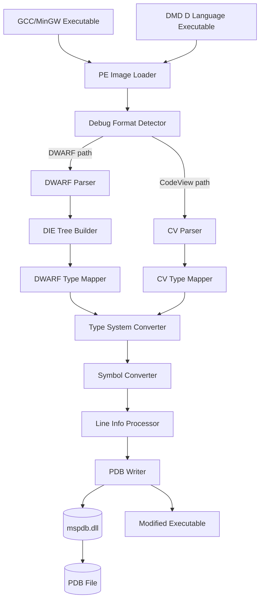
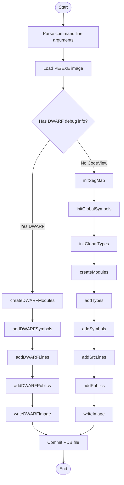
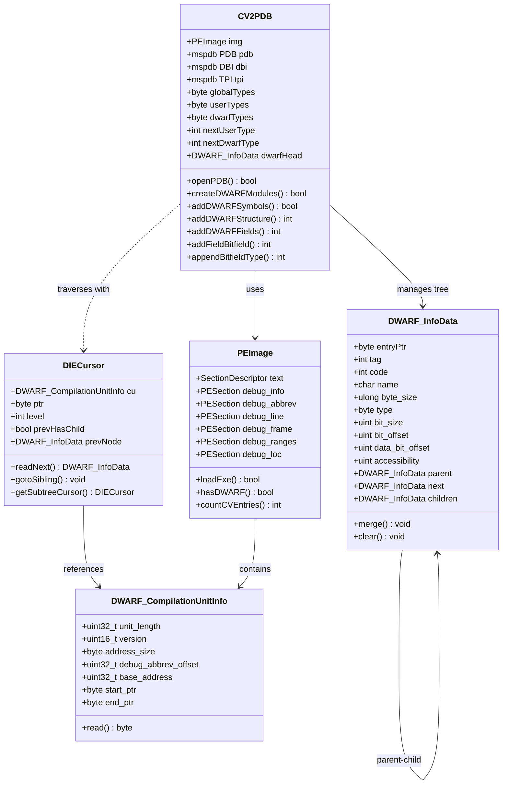
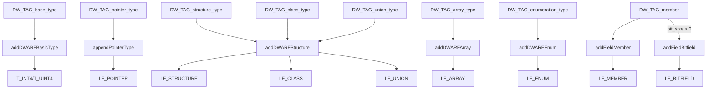

# CV2PDB Architecture and Implementation Guide

> 🎯 **SIMPLE SOLUTION: NO PLUGINS NEEDED!**
>
> **All diagrams use Mermaid** - Works natively in VSCode!
>
> **To view diagrams**:
> 1. Open this file in VSCode
> 2. Press `Ctrl+Shift+V` (Windows/Linux) or `Cmd+Shift+V` (Mac)
> 3. Done! All diagrams render automatically
>
> **No PlantUML, No StarUML, No Java, No problems!**

## Viewing Diagrams

### ✅ Mermaid Diagrams Work Without Any Setup!

**Just follow these simple steps:**

1. **Open this file** in VSCode
2. **Press** `Ctrl+Shift+V` (Windows/Linux) or `Cmd+Shift+V` (Mac)
3. **Done!** All diagrams will render automatically in the preview

**That's it! No plugins, no installation, no configuration needed!**

### Optional: Enhanced Mermaid Support

For syntax highlighting while editing (optional):
```bash
code --install-extension bierner.markdown-mermaid
```

### Why We Use Only Mermaid

- ✅ **No installation required** - works immediately in VSCode
- ✅ **Native VSCode support** - built into Markdown preview
- ✅ **No Java needed** - unlike PlantUML
- ✅ **No plugins needed** - unlike StarUML
- ✅ **GitHub compatible** - renders on GitHub too
- ✅ **Simple and reliable** - no complex setup or licensing

## Table of Contents
1. [Overview](#overview)
2. [System Architecture](#system-architecture)
3. [Main Workflow](#main-workflow)
4. [Core Class Architecture](#core-class-architecture)
5. [Type Conversion System](#type-conversion-system)
6. [Bitfield Implementation](#bitfield-implementation)
7. [Key Functions](#key-functions)
8. [Conversion Sequence](#conversion-sequence)
9. [Example: Bitfield Conversion](#example-bitfield-conversion)

## Overview

**cv2pdb** is a tool that converts DWARF debug information (from GCC/MinGW) and DMD CodeView debug information into Microsoft PDB (Program Database) files for use with Visual Studio debuggers.

### Purpose
- Enable debugging of GCC/MinGW compiled binaries in Visual Studio
- Convert D language debug info to PDB format
- Support C/C++ projects using non-MSVC toolchains

## System Architecture

### High-Level System Overview (Mermaid)




### Data Flow Pipeline (Mermaid)

```mermaid
graph LR
    A1[Load PE/EXE file]
    A2[Map debug sections]
    A3[Identify format]

    B1{Format?}
    B2[Parse DWARF]
    B3[Build DIE tree]
    B4[Map DWARF types]
    B5[Parse CodeView]
    B6[Update indices]
    B7[Deduplicate types]
    B8[Assign type IDs]

    C1[Convert functions]
    C2[Process globals]
    C3[Handle locals]
    C4[Convert parameters]

    D1[Process line numbers]
    D2[Map source to address]
    D3[Generate public symbols]
    D4[Create modules]

    E1[Create PDB via mspdb.dll]
    E2[Write TPI stream]
    E3[Write DBI stream]
    E4[Write line info]
    E5[Update executable]
    E6[Add RSDS signature]

    A1 --> A2
    A2 --> A3
    A3 --> B1

    B1 -->|DWARF| B2
    B2 --> B3
    B3 --> B4
    B1 -->|CodeView| B5
    B5 --> B6
    B4 --> B7
    B6 --> B7
    B7 --> B8

    B8 --> C1
    C1 --> C2
    C2 --> C3
    C3 --> C4

    C4 --> D1
    D1 --> D2
    D2 --> D3
    D3 --> D4

    D4 --> E1
    E1 --> E2
    E2 --> E3
    E3 --> E4
    E4 --> E5
    E5 --> E6
```



### Component Interaction Diagram

*[Component interaction is shown in the System Architecture diagram above]*

### Deployment and Dependencies Diagram

*[See the System Architecture diagram for deployment overview]*


## Main Workflow

### Main Execution Flow (Mermaid)



### Main Entry Point
**File:** `src/main.cpp:187-349`

Key steps:
1. **Parse arguments** - Extract options like D version, debug level, output paths
2. **Load executable** - Read PE/EXE file using `PEImage::loadExe()`
3. **Check debug format** - Determine if DWARF or CodeView
4. **Create CV2PDB instance** - Initialize converter with image and debug level
5. **Open PDB** - Create output PDB file via mspdb.dll
6. **Convert debug info** - Call appropriate conversion path
7. **Write output** - Generate modified executable with PDB reference

## Core Class Architecture

### Core Classes (Mermaid)



### Class Descriptions

#### CV2PDB
**File:** `src/cv2pdb.h:29-308`, `src/cv2pdb.cpp`

The main converter class that orchestrates the entire conversion process.

**Key Responsibilities:**
- Manage PDB file creation and writing via mspdb.dll interfaces
- Maintain type storage buffers (globalTypes, userTypes, dwarfTypes)
- Build and traverse DWARF tree structure
- Convert types from DWARF to CodeView format
- Convert symbols (functions, variables) to PDB format
- Handle line number information

**Type Storage:**
- `globalTypes`: Original CodeView types from input
- `userTypes`: Converted user-defined types
- `dwarfTypes`: Types converted from DWARF (size: ~64KB per type)
- Type IDs start at `BASE_USER_TYPE` (0x1000)

#### PEImage
**File:** `src/PEImage.h`, `src/PEImage.cpp`

Handles loading and parsing of PE/EXE files and their debug sections.

**Debug Sections:**
- `.debug_info`: DWARF DIE (Debug Information Entry) data
- `.debug_abbrev`: Abbreviation tables for DIEs
- `.debug_line`: Source line number information
- `.debug_frame`: Call frame information (stack unwinding)
- `.debug_ranges`: Non-contiguous address ranges
- `.debug_loc`: Location lists (variable locations)

#### DWARF_InfoData
**File:** `src/readDwarf.h:187-340`

In-memory representation of a DWARF Debug Information Entry (DIE).

**Structure:**
- Forms a tree via `parent`, `next`, `children` pointers
- Contains all DWARF attributes (name, type, size, location, etc.)
- Special bitfield attributes: `bit_size`, `bit_offset`, `data_bit_offset`
- `merge()` method combines attributes from specifications/abstract origins

**Tags (examples):**
- `DW_TAG_compile_unit`: Compilation unit root
- `DW_TAG_subprogram`: Function/procedure
- `DW_TAG_structure_type`: Struct/class
- `DW_TAG_member`: Structure member
- `DW_TAG_variable`: Variable declaration

#### DIECursor
**File:** `src/readDwarf.h:572-638`

Iterator for traversing the DWARF tree structure.

**Features:**
- `readNext()`: Read next DIE in depth-first order
- `gotoSibling()`: Skip children and go to next sibling
- `getSubtreeCursor()`: Create cursor for child subtree
- Tracks current level, previous node, sibling pointers
- Handles abbreviation table lookups

## Type Conversion System

### Type Conversion (Mermaid)



### Type Mapping Table

| DWARF Type | CodeView Type | Conversion Function | Notes |
|------------|---------------|---------------------|-------|
| DW_TAG_base_type | T_INT4, T_UINT4, T_REAL32, etc. | `addDWARFBasicType()` | Maps encoding + size to PDB basic types |
| DW_TAG_pointer_type | LF_POINTER | `appendPointerType()` | Creates pointer to target type |
| DW_TAG_structure_type | LF_STRUCTURE | `addDWARFStructure()` | Includes field list |
| DW_TAG_class_type | LF_CLASS | `addDWARFStructure()` | Includes field list, methods |
| DW_TAG_union_type | LF_UNION | `addDWARFStructure()` | All fields at offset 0 |
| DW_TAG_array_type | LF_ARRAY | `addDWARFArray()` | Element type + dimensions |
| DW_TAG_enumeration_type | LF_ENUM | `addDWARFEnum()` | Underlying type + enumerators |
| DW_TAG_member | LF_MEMBER | `addFieldMember()` | Regular field in struct |
| DW_TAG_member (bitfield) | LF_BITFIELD + LF_MEMBER | `addFieldBitfield()` | When bit_size > 0 |

### Type ID Management

**File:** `src/cv2pdb.h:251-254`

```cpp
static constexpr int BASE_USER_TYPE = 0x1000;
int nextUserType = BASE_USER_TYPE;   // For CodeView conversions
int nextDwarfType = BASE_USER_TYPE;  // For DWARF conversions
```

- Type IDs < 0x1000: Predefined types (T_INT4, T_VOID, etc.)
- Type IDs >= 0x1000: User-defined types
- `mapEntryPtrToTypeID`: Maps DWARF DIE pointer to assigned type ID
- Prevents duplicate type creation via lookup

## Bitfield Implementation

Bitfields are structure members that occupy a specific number of bits within a storage unit (typically an integer).

### DWARF Bitfield Attributes

**File:** `src/readDwarf.h:257-259`

Three attributes define a bitfield:

1. **`bit_size`** (DW_AT_bit_size)
   - Number of bits in the bitfield
   - If 0, this is not a bitfield
   - Always present for bitfields

2. **`bit_offset`** (DW_AT_bit_offset) - **DWARF2/3 only**
   - Offset from **MSB** (most significant bit) of storage unit
   - Must be converted to LSB offset for little-endian systems
   - Formula: `lsb_offset = storage_size_bits - bit_offset - bit_size`

3. **`data_bit_offset`** (DW_AT_data_bit_offset) - **DWARF4/5 only**
   - Absolute bit offset from start of containing structure
   - Already in LSB format
   - Byte offset: `data_bit_offset / 8`
   - Bit offset within byte: `data_bit_offset % 8`

### CodeView Bitfield Type

**File:** `src/mscvpdb.h` (CodeView type definitions)

PDB represents bitfields using `LF_BITFIELD` types:

```cpp
struct codeview_bitfield_v2 {
    int type;            // Base type (T_INT4, T_UINT4, etc.)
    unsigned char nbits; // Number of bits
    unsigned char bitoff; // Bit offset from LSB
};
```

Each bitfield member gets:
1. An `LF_BITFIELD` type defining the bit layout
2. An `LF_MEMBER` field referencing that bitfield type

### Bitfield Conversion Algorithm

**File:** `src/dwarf2pdb.cpp:1106-1150`

```cpp
if (id.bit_size > 0) {
    int bit_offset_in_unit = 0;

    // Check if new storage unit or continuation
    if (field_offset != last_bitfield_byte_offset) {
        cumulative_bit_offset = 0;
        last_bitfield_byte_offset = field_offset;
    }

    if (id.data_bit_offset > 0) {
        // DWARF4/5: absolute bit offset
        field_offset = baseoff + (id.data_bit_offset / 8);
        bit_offset_in_unit = id.data_bit_offset % 8;
    }
    else if (id.bit_offset >= 0) {
        // DWARF2/3: MSB offset -> LSB offset
        int storage_size_bits = typeEntry->byte_size * 8;
        bit_offset_in_unit = storage_size_bits - id.bit_offset - id.bit_size;
    }
    else {
        // No offset: sequential bitfields
        bit_offset_in_unit = cumulative_bit_offset;
    }

    // Create bitfield
    addFieldBitfield(dfieldtype, cv_attr, bit_offset_in_unit,
                     id.bit_size, type_to_use, id.name);

    // Track next position
    cumulative_bit_offset = bit_offset_in_unit + id.bit_size;
}
```

**Steps:**
1. **Detect bitfield**: Check if `bit_size > 0`
2. **Determine byte offset**: Calculate which byte contains the bitfield
3. **Calculate bit offset within byte**:
   - **DWARF4/5**: Use `data_bit_offset % 8` (already LSB)
   - **DWARF2/3**: Convert MSB to LSB: `storage_bits - bit_offset - bit_size`
   - **Sequential**: Use cumulative offset for packed bitfields
4. **Create LF_BITFIELD type**: Call `appendBitfieldType()`
5. **Add LF_MEMBER**: Call `addFieldBitfield()`
6. **Update tracking**: Save cumulative offset for next bitfield

### Bitfield Creation Functions

#### appendBitfieldType()
**File:** `src/cv2pdb.cpp:821-843`

Creates an `LF_BITFIELD` type record in the PDB format.

**Purpose:** Defines a bitfield type that specifies how many bits are used and where they're located within a storage unit.

```cpp
int CV2PDB::appendBitfieldType(int base_type, int bit_offset, int bit_size)
{
```

**Parameters:**
- `base_type`: The underlying integer type (e.g., T_INT4, T_UINT4)
- `bit_offset`: Bit position within the storage unit (0-based from LSB)
- `bit_size`: Number of bits in the bitfield
- **Returns:** The new type ID assigned to this bitfield type

---

```cpp
    checkUserTypeAlloc(12);
```

**Buffer Safety Check:**
- Ensures at least 12 bytes free in `userTypes` buffer
- **Why 12 bytes?** LF_BITFIELD_V2 structure (10 bytes) + padding (2 bytes)
- If insufficient space, reallocates buffer to larger size

---

```cpp
    codeview_reftype* bftype = (codeview_reftype*)(userTypes + cbUserTypes);
```

**Get Write Position:**
- `userTypes`: Base address of the type buffer (byte array)
- `cbUserTypes`: Current bytes used in buffer
- `userTypes + cbUserTypes`: Pointer arithmetic → next free position
- **Result:** `bftype` points to where we'll write the new type record

**Visual:**
```
userTypes buffer:
┌─────────────────────────────────────────┐
│ [existing types...] │ FREE SPACE        │
└─────────────────────────────────────────┘
                      ↑
                      bftype (userTypes + cbUserTypes)
```

---

```cpp
    bftype->bitfield_v2.len = 10;  // Size of structure minus 2 for the len field
```

**Set Length Field:**
- Every CodeView type record starts with 2-byte length field
- **Value 10:** Total size (12 bytes) - len field itself (2 bytes) = 10
- **Structure layout:**
  ```
  Offset  Size  Field
  0       2     len (= 10)
  2       2     id (= LF_BITFIELD_V2)
  4       4     type (base type)
  8       1     nbits (bit size)
  9       1     bitoff (bit offset)
  10      2     padding
  ```

---

```cpp
    bftype->bitfield_v2.id = LF_BITFIELD_V2;
```

**Set Type Kind:**
- `LF_BITFIELD_V2`: CodeView constant (0x1205) identifying this as bitfield type
- PDB readers use this to know how to interpret the structure

---

```cpp
    bftype->bitfield_v2.type = translateType(base_type);
```

**Set Base Type:**
- `translateType()`: Converts DWARF type ID → CodeView type ID
- Example: DWARF type 0x1234 → CodeView T_UINT4 (0x75)
- Tells the debugger what underlying type (int, unsigned int, etc.)

---

```cpp
    bftype->bitfield_v2.nbits = bit_size;
```

**Set Bit Count:**
- Number of bits this bitfield occupies
- Example: For `unsigned int x : 5;`, this is 5

---

```cpp
    bftype->bitfield_v2.bitoff = bit_offset;
```

**Set Bit Offset:**
- Starting bit position within storage unit (LSB = 0)
- Example: Bitfield at bit 3 → this is 3
- **LSB offset:** Already converted from DWARF's MSB format if needed

---

```cpp
    int bitfield_type_index = nextUserType++;
```

**Assign Type ID:**
- `nextUserType`: Global counter starting at 0x1000 (BASE_USER_TYPE)
- **Post-increment:** Returns current value, then increments
  - If `nextUserType = 0x1005`:
    - `bitfield_type_index = 0x1005`
    - `nextUserType` becomes 0x1006
- Each bitfield type gets unique ID for referencing

---

```cpp
    // Add padding to make total size 12 bytes
    unsigned char* p = (unsigned char*)(userTypes + cbUserTypes);
    p[10] = 0xf2;  // Padding byte
    p[11] = 0xf1;  // Padding byte
```

**Add Padding:**
- CodeView uses special padding values:
  - `0xf1` = 1 byte of padding
  - `0xf2` = 2 bytes of padding
  - `0xf3` = 3 bytes of padding
- **Why?** PDB format requires 4-byte alignment
- **Math:** 10 bytes (structure) + 2 bytes (padding) = 12 (divisible by 4)

**Memory layout:**
```
Offset  Value           Meaning
0-1     0A 00           len = 10
2-3     05 12           id = LF_BITFIELD_V2 (0x1205)
4-7     75 00 00 00     type = T_UINT4 (0x0075)
8       03              nbits = 3
9       05              bitoff = 5
10      F2              padding
11      F1              padding
```

---

```cpp
    cbUserTypes += 12;
```

**Update Buffer Counter:**
- Marks 12 bytes as "used" in buffer
- Next type will be written at new position

**Visual after update:**
```
userTypes buffer:
┌──────────────────────────────────────────────────┐
│ [existing][new bitfield type 12 bytes]│ FREE    │
└──────────────────────────────────────────────────┘
                                         ↑
                                         cbUserTypes
```

---

```cpp
    return bitfield_type_index;
}
```

**Return Type ID:**
- Caller needs this ID to reference the bitfield type
- Used by `addFieldBitfield()` when creating `LF_MEMBER` field

---

#### addFieldBitfield()
**File:** `src/cv2pdb.cpp:845-865`

Creates an `LF_MEMBER` field entry that references a bitfield type.

**Purpose:** Adds a structure member field that points to the bitfield type definition.

```cpp
int CV2PDB::addFieldBitfield(codeview_fieldtype* dfieldtype, int attr,
                             int bit_offset, int bit_size,
                             int base_type, const char* name)
{
```

**Parameters:**
- `dfieldtype`: Pointer to where to write field record
- `attr`: Access attribute (1=private, 2=protected, 3=public)
- `bit_offset`: Bit offset within storage unit
- `bit_size`: Number of bits
- `base_type`: Underlying integer type
- `name`: Field name (e.g., "flags")
- **Returns:** Number of bytes written (including padding)

---

```cpp
    // Create the bitfield type
    int bitfield_type_index = appendBitfieldType(base_type, bit_offset, bit_size);
```

**Create LF_BITFIELD Type:**
- Calls `appendBitfieldType()` explained above
- Writes `LF_BITFIELD` type record to buffer
- Increments `cbUserTypes`
- **Returns:** Type ID of newly created bitfield (e.g., 0x1005)

---

```cpp
    // Now add the member to the field list, referencing the bitfield type
    dfieldtype->member_v2.id = v3 ? LF_MEMBER_V3 : LF_MEMBER_V2;
```

**Set Member Kind:**
- `v3`: Global flag for PDB version
- `LF_MEMBER_V2` (0x1406): Structure member type
- Tells debugger this is a struct member

---

```cpp
    dfieldtype->member_v2.attribute = attr;
```

**Set Access Attribute:**
- 1 = private, 2 = protected, 3 = public
- Example: `public: unsigned int x : 3;` → attr = 3

---

```cpp
    dfieldtype->member_v2.type = bitfield_type_index;
```

**Link to Bitfield Type:**
- References the type ID from `appendBitfieldType()`
- Creates relationship:
  ```
  LF_MEMBER "flags"       LF_BITFIELD (0x1005)
  ├─ type = 0x1005  ─────→ ├─ base_type = T_UINT4
  ├─ offset = 0            ├─ nbits = 3
  └─ name = "flags"        └─ bitoff = 5
  ```

---

```cpp
    // For bitfields, all fields in same storage unit have offset = 0
    int byte_offset = 0;
```

**Set Byte Offset:**
- Bitfields in same storage unit share byte offset 0
- Bit position encoded in `LF_BITFIELD` type (bitoff field)
- Example:
  ```c
  struct {
      unsigned int a : 3;  // offset = 0, bitoff = 0
      unsigned int b : 5;  // offset = 0, bitoff = 3 (same byte!)
  };
  ```

---

```cpp
    int len = write_numeric_leaf(byte_offset, &(dfieldtype->member_v2.offset)) - 2;
```

**Write Offset as Numeric Leaf:**
- CodeView encodes numbers in variable-length format:
  - Small (< 0x8000): 2 bytes
  - Large: 2-byte prefix + 4-byte value
- **Returns:** Bytes written including 2-byte header
- `- 2`: Subtract header to get just offset size

---

```cpp
    len += cstrcpy_v(v3, (BYTE*)(&dfieldtype->member_v2 + 1) + len, name);
```

**Copy Field Name:**
- `&dfieldtype->member_v2 + 1`: After structure
- `+ len`: Skip past numeric leaf
- Copies null-terminated string
- **Returns:** String length + null terminator
- `len +=`: Add to running total

---

```cpp
    len += sizeof(dfieldtype->member_v2);
```

**Add Structure Size:**
- Typically 8 bytes for `member_v2` structure
- `len` now contains:
  - Structure size (8 bytes)
  - Numeric leaf (2 bytes)
  - Name string (strlen + 1)

---

```cpp
    // Pad to 4-byte boundary
    unsigned char* p = (unsigned char*) dfieldtype;
    for (; len & 3; len++)
        p[len] = 0xf4 - (len & 3);
```

**Add Padding:**
- **Loop condition:** `len & 3` (same as `len % 4`)
  - 0 if aligned (divisible by 4)
  - 1, 2, or 3 if not aligned
- **Padding values:**
  - `len % 4 == 1`: write `0xf3` (3 more bytes needed)
  - `len % 4 == 2`: write `0xf2` (2 more bytes needed)
  - `len % 4 == 3`: write `0xf1` (1 more byte needed)
- **Example:**
  ```
  len = 14 (not aligned)
  Iteration 1: 14 & 3 = 2, p[14] = 0xf2, len = 15
  Iteration 2: 15 & 3 = 3, p[15] = 0xf1, len = 16
  Loop exits: 16 & 3 = 0 (aligned)
  ```

---

```cpp
    return len;
}
```

**Return Total Length:**
- **Why return instead of updating counter internally?**
  - **Separation of concerns:** Function writes data, caller manages buffer
  - **Flexibility:** Can be used with different buffers (dwarfTypes or userTypes)
  - **Caller decides:** `cbDwarfTypes += addFieldBitfield(...)`
- Returns total bytes written including padding

**Usage by caller:**
```cpp
int bytesWritten = addFieldBitfield(dfieldtype, attr, ...);
cbDwarfTypes += bytesWritten;  // Caller updates counter
```

### Bitfield Conversion Sequence

*[Conversion process is detailed in the implementation section above]*

## Key Functions

### Type Creation and Management

*[Type management is shown in the Type Conversion diagram above]*

### Function Reference

#### getTypeByDWARFPtr()
**File:** `src/dwarf2pdb.cpp`

Main entry point for type conversion. Looks up or creates PDB type for a DWARF type pointer.

```cpp
int CV2PDB::getTypeByDWARFPtr(byte* typePtr)
{
    if (!typePtr) return 0x03; // T_VOID

    // Check cache
    auto it = mapEntryPtrToTypeID.find(typePtr);
    if (it != mapEntryPtrToTypeID.end())
        return it->second;

    // Find DIE and convert based on tag
    DWARF_InfoData* entry = findEntryByPtr(typePtr);
    switch (entry->tag) {
        case DW_TAG_base_type:
            return addDWARFBasicType(entry->name, entry->encoding, entry->byte_size);
        case DW_TAG_structure_type:
        case DW_TAG_class_type:
        case DW_TAG_union_type:
            return addDWARFStructure(*entry, cursor);
        // ... other types
    }
}
```

#### addDWARFStructure()
**File:** `src/dwarf2pdb.cpp:1229+`

Converts DWARF struct/class/union to PDB format.

```cpp
int CV2PDB::addDWARFStructure(DWARF_InfoData& id, DIECursor cursor)
{
    // Create field list
    int flbegin = cbDwarfTypes;
    bool hasBackRef = false;
    int nfields = addDWARFFields(id, cursor, 0, flbegin, hasBackRef);

    // Create LF_FIELDLIST
    // Create LF_STRUCTURE/LF_CLASS/LF_UNION
    // Register in type map
}
```

#### addDWARFFields()
**File:** `src/dwarf2pdb.cpp:1063-1199`

Processes all members of a structure, including regular fields and bitfields.

**Purpose:** Main orchestrator that iterates through DWARF structure members and converts them to CodeView field list entries.

```cpp
int CV2PDB::addDWARFFields(DWARF_InfoData& structid, DIECursor& cursor,
                          int baseoff, int flStart, bool& hasBackRef)
{
```

**Parameters:**
- `structid`: The parent structure's DWARF information
- `cursor`: Iterator positioned at first child (structure members)
- `baseoff`: Base offset for nested structures
- `flStart`: Starting position of field list in buffer
- `hasBackRef`: Output parameter indicating if type has forward references
- **Returns:** Number of fields processed

---

```cpp
    int cumulative_bit_offset = 0;
    int last_bitfield_byte_offset = -1;
```

**Initialize Bitfield Tracking:**
- `cumulative_bit_offset`: Tracks next available bit position for consecutive bitfields
  - Example: If first bitfield uses bits 0-2, this becomes 3
  - Used when DWARF doesn't specify explicit bit offsets
- `last_bitfield_byte_offset`: Tracks which byte the previous bitfield was in
  - Used to detect when we move to a new storage unit
  - Initialized to -1 (invalid) to indicate "no previous bitfield"

**Example progression:**
```c
struct {
    unsigned int a : 3;  // cumulative = 3, last_byte = 0
    unsigned int b : 5;  // cumulative = 8, last_byte = 0 (same)
    unsigned int c : 2;  // cumulative = 2, last_byte = 1 (new byte, reset)
};
```

---

```cpp
    DWARF_InfoData id;
    while (cursor.readNext(&id, true)) {
```

**Loop Through Structure Members:**
- `cursor.readNext(&id, true)`: Read next DWARF DIE (Debug Information Entry)
  - `&id`: Fills structure with member information
  - `true`: Stop at null entry (end of children)
- Loop continues until all members processed

---

```cpp
        if (id.tag == DW_TAG_member) {
```

**Check if This is a Member Field:**
- `DW_TAG_member`: DWARF tag for structure/class member
- Other tags (not processed here):
  - `DW_TAG_inheritance`: Base class
  - `DW_TAG_subprogram`: Member function

---

```cpp
            if (id.bit_size > 0) {
```

**Detect Bitfield:**
- `id.bit_size`: DWARF attribute `DW_AT_bit_size`
  - 0 for regular fields
  - > 0 for bitfields (indicates number of bits)
- Example: For `unsigned int flags : 3;`, `id.bit_size = 3`

---

### Bitfield Processing Section

```cpp
                int bit_offset_in_unit = 0;
```

**Initialize Bit Offset:**
- Will be calculated based on DWARF version and available attributes
- This is the offset from LSB (Least Significant Bit) of storage unit

---

```cpp
                // Check if this is a new storage unit or continuation
                if (field_offset != last_bitfield_byte_offset) {
                    cumulative_bit_offset = 0;
                    last_bitfield_byte_offset = field_offset;
                }
```

**Detect Storage Unit Boundaries:**

**Purpose:** Determine if bitfield is in new byte or continues in same byte

**Logic:**
- `field_offset`: Byte offset of current bitfield
- `last_bitfield_byte_offset`: Byte offset of previous bitfield
- **If different:** New storage unit detected
  - Reset `cumulative_bit_offset = 0` (start from bit 0)
  - Save current offset for next comparison
- **If same:** Same storage unit
  - Keep `cumulative_bit_offset` unchanged

**Example:**
```c
struct {
    unsigned int a : 3;  // field_offset = 0, NEW (0 != -1)
    unsigned int b : 5;  // field_offset = 0, SAME (0 == 0)
    unsigned int c : 4;  // field_offset = 1, NEW (1 != 0)
};
```

---

```cpp
                if (id.data_bit_offset != (unsigned int)-1) {
                    // DWARF4/5: data_bit_offset is absolute offset from beginning of struct
                    // Note: data_bit_offset can be 0 for first bitfield, so we check != -1
                    field_offset = baseoff + (id.data_bit_offset / 8);
                    bit_offset_in_unit = id.data_bit_offset % 8;
                }
```

**DWARF4/5 Handling (Modern Format):**

**`id.data_bit_offset`:** DWARF attribute `DW_AT_data_bit_offset`
- Absolute bit offset from start of structure
- Only present in DWARF 4 and later
- Initialized to `(unsigned int)-1` if not present

**Why `!= (unsigned int)-1` instead of `> 0`?**
- **BUG FIX:** First bitfield can legitimately have offset 0
- **Old code:** Used `> 0`, which FAILED for first bitfield
- **Solution:** Use sentinel value -1 for "not set"

**Calculations:**
- **`field_offset = baseoff + (id.data_bit_offset / 8)`**
  - Division by 8: Which byte contains the bitfield
  - `baseoff`: Base offset for nested structs (usually 0)
  - Result: Absolute byte offset

- **`bit_offset_in_unit = id.data_bit_offset % 8`**
  - Modulo 8: Which bit within that byte
  - Already in LSB format (bit 0 = least significant)

**Example:**
```c
struct {
    unsigned int a : 3;  // data_bit_offset = 0  → byte 0, bit 0
    unsigned int b : 5;  // data_bit_offset = 3  → byte 0, bit 3
    unsigned int c : 24; // data_bit_offset = 8  → byte 1, bit 0
};

Calculations:
a: field_offset = 0 + (0/8) = 0, bit_offset = 0%8 = 0
b: field_offset = 0 + (3/8) = 0, bit_offset = 3%8 = 3
c: field_offset = 0 + (8/8) = 1, bit_offset = 8%8 = 0
```

---

```cpp
                else if (id.bit_offset >= 0) {
                    // DWARF2/3: bit_offset is from MSB (Most Significant Bit)
                    // Need to convert to LSB offset
                    const DWARF_InfoData* typeEntry = findEntryByPtr(id.type);
                    if (typeEntry && typeEntry->byte_size > 0) {
                        int storage_size_bits = typeEntry->byte_size * 8;
                        bit_offset_in_unit = storage_size_bits - id.bit_offset - id.bit_size;
                    }
                }
```

**DWARF2/3 Handling (Older Format):**

**`id.bit_offset`:** DWARF attribute `DW_AT_bit_offset`
- Offset from **MSB** (Most Significant Bit) - Big Endian convention
- Only in DWARF 2/3 (deprecated in DWARF 4)
- Must convert to LSB for little-endian PDB

**Conversion Algorithm:**
1. **`findEntryByPtr(id.type)`**: Look up base type definition
   - Example: Find `unsigned int` type

2. **`typeEntry->byte_size`**: Get storage unit size
   - Example: `unsigned int` = 4 bytes

3. **`storage_size_bits = typeEntry->byte_size * 8`**: Convert to bits
   - Example: 4 × 8 = 32 bits

4. **`bit_offset_in_unit = storage_size_bits - id.bit_offset - id.bit_size`**
   - Formula: `LSB_offset = total_bits - MSB_offset - bit_size`

**Example Conversion:**
```c
// 32-bit unsigned int, bitfield using bits 0-2 from LSB
unsigned int x : 3;

DWARF2/3 (MSB encoding):
  bit_offset = 29     (from bit 31 MSB, counting down)
  bit_size = 3

Conversion:
  LSB_offset = 32 - 29 - 3 = 0  ✓

Visualization:
MSB                                           LSB
31 30 29 28 27 ... 4  3  2  1  0
|  |  x  x  x  ... |  |  |  |  |
      ↑
      bit_offset=29 (from MSB) points to same field as
                               ↑
                               bit_offset=0 (from LSB)
```

---

```cpp
                else {
                    // No offset specified, use cumulative offset for consecutive bitfields
                    bit_offset_in_unit = cumulative_bit_offset;
                }
```

**Fallback for Unspecified Offset:**

**When this happens:**
- Neither `data_bit_offset` nor `bit_offset` is set
- Some compilers don't emit explicit offsets
- Assumes bitfields are packed consecutively

**Logic:**
- Use cumulative offset from previous bitfields
- Automatically packs bitfields sequentially

**Example:**
```c
struct {
    unsigned int a : 3;  // bit_offset_in_unit = 0 (default)
    unsigned int b : 5;  // bit_offset_in_unit = 3 (cumulative)
    unsigned int c : 2;  // bit_offset_in_unit = 8 (cumulative)
};
```

---

```cpp
                // Convert DWARF accessibility to CodeView attribute:
                // DWARF: public=1, protected=2, private=3
                // CodeView: private=1, protected=2, public=3
                int attr = 3; // default to public
                if (id.accessibility == 1) attr = 3;  // DW_ACCESS_public -> CV public
                else if (id.accessibility == 2) attr = 2;  // DW_ACCESS_protected -> CV protected
                else if (id.accessibility == 3) attr = 1;  // DW_ACCESS_private -> CV private
```

**Access Modifier Conversion:**

**DWARF encoding:**
- `DW_AT_accessibility` attribute
- 1 = public, 2 = protected, 3 = private
- Default (not specified) = public

**CodeView encoding:**
- 1 = private, 2 = protected, 3 = public
- **Note:** Values are REVERSED!

**Conversion table:**
| DWARF | C++ Keyword | CodeView |
|-------|-------------|----------|
| 1     | public      | 3        |
| 2     | protected   | 2        |
| 3     | private     | 1        |
| (none)| public      | 3        |

**Example:**
```cpp
class MyClass {
private:
    unsigned int flags : 8;  // id.accessibility = 3 → attr = 1
protected:
    unsigned int state : 4;  // id.accessibility = 2 → attr = 2
public:
    unsigned int count : 4;  // id.accessibility = 1 → attr = 3
};
```

---

```cpp
                cbDwarfTypes += addFieldBitfield(dfieldtype, attr, bit_offset_in_unit,
                                                id.bit_size, type_to_use, id.name);
```

**Create Bitfield Member:**

**What happens (in order):**

1. **Call `addFieldBitfield()`** with:
   - `dfieldtype`: Pointer to write position in field list buffer
   - `attr`: Access attribute (1=private, 2=protected, 3=public)
   - `bit_offset_in_unit`: Bit offset from LSB (calculated above)
   - `id.bit_size`: Number of bits
   - `type_to_use`: Converted base type ID
   - `id.name`: Field name (e.g., "flags")

2. **Inside `addFieldBitfield()`:**
   - Calls `appendBitfieldType()` → creates `LF_BITFIELD` type in `userTypes` buffer
   - Creates `LF_MEMBER` field in `dwarfTypes` buffer
   - Returns total bytes written

3. **Update buffer position:**
   - `cbDwarfTypes += bytesWritten`
   - Marks those bytes as "used"
   - Next field writes after this one

**Data flow:**
```
addFieldBitfield()
    ├─→ appendBitfieldType()
    │   ├─ Writes to userTypes buffer
    │   ├─ Updates cbUserTypes
    │   ├─ Increments nextUserType
    │   └─ Returns type ID (e.g., 0x1005)
    │
    ├─ Creates LF_MEMBER
    │   ├─ References type ID from above
    │   ├─ Writes to dwarfTypes buffer
    │   └─ Calculates total bytes written
    │
    └─→ Returns bytes written
        └─ Caller updates cbDwarfTypes
```

---

```cpp
                // Update cumulative bit offset for next bitfield in same unit
                cumulative_bit_offset = bit_offset_in_unit + id.bit_size;
                nfields++;
```

**Update Tracking Variables:**

**`cumulative_bit_offset = bit_offset_in_unit + id.bit_size`:**
- Calculates where next bitfield should start
- Only matters if next bitfield is in same storage unit
- Example: Bitfield at bit 3 with size 5
  - `cumulative_bit_offset = 3 + 5 = 8`
  - Next bitfield in same byte starts at bit 8

**`nfields++`:**
- Increment field counter
- Tracks total structure members
- Returned at end of function

**Example progression:**
```c
struct {
    unsigned int a : 3;  // bit_offset=0, after: cumulative=3, nfields=1
    unsigned int b : 5;  // bit_offset=3, after: cumulative=8, nfields=2
    int regular;         // (regular field), nfields=3
    unsigned int c : 2;  // bit_offset=0, after: cumulative=2, nfields=4
};

Step by step:
1. Process 'a': cumulative goes from 0 to 3
2. Process 'b': same byte, use cumulative=3, then set to 8
3. Process 'regular': reset tracking (not shown), nfields=3
4. Process 'c': new byte, cumulative reset to 0, then set to 2
```

---

### Regular Field Processing

```cpp
            } else {
                // Regular field (not a bitfield)
                // Reset bitfield tracking for next group
                last_bitfield_byte_offset = -1;
                cumulative_bit_offset = 0;

                // Process as regular field
                addFieldMember(dfieldtype, cv_attr, field_offset,
                              type_to_use, id.name);
            }
```

**Handle Non-Bitfield Members:**
- Reset bitfield tracking (next bitfield group starts fresh)
- Call `addFieldMember()` instead of `addFieldBitfield()`
- No `LF_BITFIELD` type created, uses type directly

**Difference from bitfield:**
```
Bitfield:
  LF_MEMBER → LF_BITFIELD → T_UINT4

Regular:
  LF_MEMBER → T_INT4 (direct)
```

---

```cpp
        }
    }
    return nfields;
}
```

**End of Function:**
- Returns total number of fields processed
- Used by caller to know how many members in structure

#### addDWARFBasicType()
**File:** `src/dwarf2pdb.cpp`

Maps DWARF basic types to PDB basic types.

```cpp
int CV2PDB::addDWARFBasicType(const char* name, int encoding, int byte_size)
{
    // encoding: DW_ATE_signed, DW_ATE_unsigned, DW_ATE_float, etc.
    // byte_size: 1, 2, 4, 8

    switch (encoding) {
        case DW_ATE_signed:
            switch (byte_size) {
                case 1: return 0x10; // T_CHAR
                case 2: return 0x11; // T_SHORT
                case 4: return 0x74; // T_INT4
                case 8: return 0x76; // T_INT8
            }
        // ... other encodings
    }
}
```

## Conversion Sequence

### Conversion Phases

1. **Initialization**
   - Load PE/EXE file
   - Create PDB file and interfaces (DBI, TPI)
   - Set up compilation unit modules

2. **Type Mapping** (`createDWARFModules()`)
   - Parse all DWARF DIEs into tree structure
   - Build lookup maps (entryPtr -> DIE, entryPtr -> typeID)
   - Convert all types to PDB format
   - Handle forward references and circular dependencies

3. **Symbol Conversion** (`addDWARFSymbols()`)
   - Traverse tree for functions (DW_TAG_subprogram)
   - Create S_GPROC/S_LPROC symbols
   - Add parameters and local variables
   - Process global variables

4. **Line Numbers** (`addDWARFLines()`)
   - Parse .debug_line section
   - Map source file:line to code address
   - Add to PDB modules

5. **Public Symbols** (`addDWARFPublics()`)
   - Add externally visible symbols
   - Enable symbol lookup by name

6. **Finalization**
   - Update executable debug directory
   - Write RSDS signature with PDB path
   - Commit PDB file

## Example: Bitfield Conversion

### C Source Code

```c
struct MyStruct {
    unsigned int a : 3;   // 3 bits at offset 0
    unsigned int b : 5;   // 5 bits at offset 3
    unsigned int c : 24;  // 24 bits at offset 8
    int d;                // regular field at byte offset 4
};
```

### DWARF Representation

```
DW_TAG_structure_type
  DW_AT_name: "MyStruct"
  DW_AT_byte_size: 8

  DW_TAG_member
    DW_AT_name: "a"
    DW_AT_type: <unsigned int>
    DW_AT_data_bit_offset: 0
    DW_AT_bit_size: 3

  DW_TAG_member
    DW_AT_name: "b"
    DW_AT_type: <unsigned int>
    DW_AT_data_bit_offset: 3
    DW_AT_bit_size: 5

  DW_TAG_member
    DW_AT_name: "c"
    DW_AT_type: <unsigned int>
    DW_AT_data_bit_offset: 8
    DW_AT_bit_size: 24

  DW_TAG_member
    DW_AT_name: "d"
    DW_AT_type: <int>
    DW_AT_data_member_location: 4
```

### PDB Representation

```
LF_STRUCTURE "MyStruct"
  size: 8
  field_list: <fieldlist_1>

<fieldlist_1> LF_FIELDLIST

  LF_MEMBER "a"
    type: <bitfield_type_1>
    offset: 0

  LF_MEMBER "b"
    type: <bitfield_type_2>
    offset: 0

  LF_MEMBER "c"
    type: <bitfield_type_3>
    offset: 1

  LF_MEMBER "d"
    type: T_INT4
    offset: 4

<bitfield_type_1> LF_BITFIELD
  base_type: T_UINT4
  nbits: 3
  bitoff: 0

<bitfield_type_2> LF_BITFIELD
  base_type: T_UINT4
  nbits: 5
  bitoff: 3

<bitfield_type_3> LF_BITFIELD
  base_type: T_UINT4
  nbits: 24
  bitoff: 0
```

### Conversion Steps

1. **Structure "a"** (data_bit_offset=0, bit_size=3)
   - Byte offset: `0 / 8 = 0`
   - Bit offset: `0 % 8 = 0`
   - Create `LF_BITFIELD(T_UINT4, nbits=3, bitoff=0)` → type ID 0x1001
   - Create `LF_MEMBER("a", type=0x1001, offset=0)`

2. **Structure "b"** (data_bit_offset=3, bit_size=5)
   - Byte offset: `3 / 8 = 0` (same byte as 'a')
   - Bit offset: `3 % 8 = 3`
   - Create `LF_BITFIELD(T_UINT4, nbits=5, bitoff=3)` → type ID 0x1002
   - Create `LF_MEMBER("b", type=0x1002, offset=0)`

3. **Structure "c"** (data_bit_offset=8, bit_size=24)
   - Byte offset: `8 / 8 = 1` (new byte)
   - Bit offset: `8 % 8 = 0` (starts at LSB of byte 1)
   - Create `LF_BITFIELD(T_UINT4, nbits=24, bitoff=0)` → type ID 0x1003
   - Create `LF_MEMBER("c", type=0x1003, offset=1)`

4. **Regular field "d"** (offset=4, type=int)
   - Create `LF_MEMBER("d", type=T_INT4, offset=4)`

### Memory Layout

```
Byte 0:  [bbbbbaaa]  (a: bits 0-2, b: bits 3-7)
Byte 1:  [cccccccc]  (c: bits 0-7)
Byte 2:  [cccccccc]  (c: bits 8-15)
Byte 3:  [cccccccc]  (c: bits 16-23)
Byte 4-7: [dddddddd]  (d: int, 4 bytes)
```

## Implementation Files

| File | Lines | Description |
|------|-------|-------------|
| `src/main.cpp` | 350 | Entry point, command-line parsing, orchestration |
| `src/cv2pdb.h` | 311 | CV2PDB class declaration |
| `src/cv2pdb.cpp` | ~3000 | CV2PDB implementation, type conversion, field handling |
| `src/dwarf2pdb.cpp` | ~2500 | DWARF-specific conversion (structures, symbols, functions) |
| `src/readDwarf.h` | 645 | DWARF data structures (InfoData, DIECursor, Location) |
| `src/readDwarf.cpp` | ~2000 | DWARF parsing, DIE reading, location expressions |
| `src/PEImage.h/cpp` | ~1500 | PE file loading, section management |
| `src/mscvpdb.h` | ~1000 | CodeView/PDB type definitions |
| `src/dwarf.h` | ~500 | DWARF constants (tags, attributes, encodings) |

### Key Code Locations

| Function | File:Line | Purpose |
|----------|-----------|---------|
| `main()` | `src/main.cpp:187` | Program entry point |
| `CV2PDB::openPDB()` | `src/cv2pdb.cpp:135` | Create PDB file |
| `CV2PDB::createDWARFModules()` | `src/dwarf2pdb.cpp` | Initialize DWARF processing |
| `CV2PDB::addDWARFStructure()` | `src/dwarf2pdb.cpp:1229+` | Convert struct/class/union |
| `CV2PDB::addDWARFFields()` | `src/dwarf2pdb.cpp:1063` | Process structure members |
| `CV2PDB::appendBitfieldType()` | `src/cv2pdb.cpp:821` | Create LF_BITFIELD type |
| `CV2PDB::addFieldBitfield()` | `src/cv2pdb.cpp:845` | Add bitfield member |
| `CV2PDB::addDWARFProc()` | `src/dwarf2pdb.cpp:854` | Convert function symbols |
| `DIECursor::readNext()` | `src/readDwarf.cpp` | Read next DWARF DIE |
| `decodeLocation()` | `src/readDwarf.cpp:112` | Evaluate location expressions |

## Bitfield Testing

To test bitfield support:

1. **Compile with debug info:**
   ```bash
   gcc -g -gdwarf-4 test_bitfield.c -o test_bitfield.exe
   ```

2. **Convert to PDB:**
   ```bash
   cv2pdb test_bitfield.exe
   ```

3. **Verify in Visual Studio:**
   - Open test_bitfield.exe in VS debugger
   - Set breakpoint in function using struct with bitfields
   - Inspect structure in Watch window
   - Verify bitfield values are correctly displayed
   - Try modifying bitfield values

4. **Check with cvdump:**
   ```bash
   cvdump -t test_bitfield.pdb | grep -A 10 "LF_BITFIELD"
   ```

## References

- **DWARF Specification**: http://dwarfstd.org/
- **Microsoft PDB Format**: https://github.com/microsoft/microsoft-pdb
- **CodeView Type Records**: Part of Microsoft Debug Interface Access SDK
- **cv2pdb Repository**: https://github.com/rainers/cv2pdb

## Bug Fixes and Recent Changes

### Critical Bugs Fixed

This section documents critical bugs that were discovered and fixed in the bitfield implementation.

#### Bug #1: data_bit_offset Zero Value Handling (Fixed)

**Problem:**
The code incorrectly checked `if (id.data_bit_offset > 0)` which failed when `data_bit_offset` was 0 (the first bitfield in a structure). This caused the first bitfield to be misprocessed.

**File:** `src/dwarf2pdb.cpp`

**Incorrect Code:**
```cpp
if (id.data_bit_offset > 0)
{
    // DWARF4/5: data_bit_offset is absolute offset from beginning of struct
    field_offset = baseoff + (id.data_bit_offset / 8);
    bit_offset_in_unit = id.data_bit_offset % 8;
}
```

**Fix:**
```cpp
if (id.data_bit_offset != (unsigned int)-1)
{
    // DWARF4/5: data_bit_offset is absolute offset from beginning of struct
    // Note: data_bit_offset can be 0 for first bitfield, so we check != -1
    field_offset = baseoff + (id.data_bit_offset / 8);
    bit_offset_in_unit = id.data_bit_offset % 8;
}
```

**Impact:**
- First bitfield members (at offset 0) are now correctly processed
- Fixes DWARF4/5 bitfield debugging
- `data_bit_offset` is initialized to `(unsigned int)-1` to distinguish "not set" from valid value 0

#### Bug #2: Missing Access Modifier Support (Fixed)

**Problem:**
Bitfield members were always created with hardcoded public access (attribute=3), ignoring C++ access specifiers (public/private/protected).

**Files:** `src/dwarf2pdb.cpp`, `src/readDwarf.h`, `src/readDwarf.cpp`

**Fix Applied:**
1. Added `unsigned int accessibility` field to `DWARF_InfoData` structure
2. Added parsing for `DW_AT_accessibility` attribute
3. Implemented proper DWARF→CodeView access modifier conversion:
   - DWARF: public=1, protected=2, private=3
   - CodeView: private=1, protected=2, public=3

**Code in dwarf2pdb.cpp:**
```cpp
// Convert DWARF accessibility to CodeView attribute:
// DWARF: public=1, protected=2, private=3
// CodeView: private=1, protected=2, public=3
int attr = 3; // default to public
if (id.accessibility == 1) attr = 3;  // DW_ACCESS_public -> CV public
else if (id.accessibility == 2) attr = 2;  // DW_ACCESS_protected -> CV protected
else if (id.accessibility == 3) attr = 1;  // DW_ACCESS_private -> CV private
cbDwarfTypes += addFieldBitfield(dfieldtype, attr, bit_offset_in_unit, id.bit_size, type_to_use, id.name);
```

**Impact:**
- C++ class bitfield members now properly show public/private/protected in debugger
- Matches behavior of MSVC-compiled code

#### Bug #3: Type ID Sequencing Bug (Identified - NOT FIXED)

**Problem:**
Commit a58c8b5 "bit field work" introduced a complex buffer management scheme that wrote bitfield types to `dwarfTypes` buffer, then copied them to `userTypes` buffer. This broke type ID sequencing, causing:
- Typedef structs displayed as pointer types (`Ptr32 Int4B`) instead of struct types
- Type records appeared in wrong order in PDB
- PDB symbols failed to load correctly in debuggers

**Root Cause:**
The change tried to reserve type IDs for field lists before writing bitfield types, but the copying mechanism caused type IDs to be assigned out of sequence from their buffer positions, which mspdb.dll requires to match.

**Solution:**
Reverted to commit d5fd98e (before a58c8b5), which uses the simpler approach of writing all types directly to their final buffer location. Then cherry-picked only the bug fixes (#1 and #2 above) from later commits without the broken buffer management code.

**Avoided Code (from a58c8b5):**
- Writing bitfield types to `dwarfTypes` instead of `userTypes`
- Complex type ID reservation for field lists
- Memcpy from `dwarfTypes` to `userTypes` after field processing

### Testing

Verified fixes using:
- **CDB**: `dt -v module!my_struct` correctly shows `struct my_struct, 0 elements, 0x4 bytes`
- **llvm-pdbutil**: Type records appear in correct sequence
- **Visual Studio**: PDB loads successfully, bitfield types display correctly
- **Comparison**: Output matches known-good commit 9b971ca with no regressions

### Implementation Details

The bitfield implementation now correctly handles:

1. **DWARF4/5 data_bit_offset attribute** - Absolute bit offset from structure start (including value 0)
2. **DWARF2/3 bit_offset attribute** - MSB offset requiring conversion to LSB
3. **Consecutive bitfields** - Tracking cumulative bit position within storage units
4. **Accessibility attributes** - Converting DWARF access specifiers to CodeView format
5. **Storage unit detection** - Properly grouping bitfields sharing the same byte offset

These changes ensure correct bitfield debugging in Visual Studio for code compiled with GCC/MinGW across different DWARF versions.

## DWARF-5 Support (2025-10)

### Bug #4: PE Section Name Truncation Causing DWARF-5 Failures

**Problem:**
DWARF-5 debug sections were not being loaded correctly, causing cv2pdb to report "no debug entries found" and either fail or crash when processing DWARF-5 executables.

**Root Cause:**
The PE format limits section names to 8 characters, causing multiple DWARF sections to have identical truncated names:
- `.debug_abbrev` → `.debug_a`
- `.debug_addr` → `.debug_a`
- `.debug_aranges` → `.debug_a`

When cv2pdb's `initDWARFSegments()` function encountered multiple sections with the same truncated name, it would overwrite the first match with subsequent ones, leading to:
- Wrong section content being loaded (e.g., `.debug_addr` content loaded as `.debug_abbrev`)
- Null pointer dereferences when expected sections were missing
- Segmentation faults during DWARF parsing

**File:** `src/PEImage.cpp:476-516`

### DWARF-5 Section Disambiguation Strategy

To resolve the section name ambiguity, we implement a multi-pronged approach:

#### 1. First-Match Priority (Implemented)

**Concept:** For truncated section names, only assign to the DWARF section if it hasn't been loaded yet.

**Implementation:**
```cpp
// src/PEImage.cpp:initDWARFSegments()
else if (strlen(name) == 8 && !strncmp(name, sec_desc->name, 8)) {
    // For truncated names, only assign if the section isn't already present
    // This prevents overwriting the first occurrence with subsequent ones
    PESection& peSec = this->*(sec_desc->pSec);
    if (!peSec.isPresent()) {
        matches = true;
    }
}
```

**Rationale:**
- PE linkers typically place sections in a predictable order
- `.debug_abbrev` usually comes before `.debug_addr`
- This simple fix prevents overwriting but doesn't guarantee correctness

#### 2. DWARF-5 Header Parsing (Implemented)

**Concept:** Parse DWARF-5 section headers to find actual data start positions.

**Implementation:**
```cpp
// src/readDwarf.cpp:79-106
if (version == 5) {
    // Parse debug_str_offsets header
    if (img.debug_str_offsets.isPresent() && img.debug_str_offsets.length > 0) {
        byte* p = img.debug_str_offsets.startByte();
        uint32_t length = RD4(p);
        uint16_t version = RD2(p);
        uint16_t padding = RD2(p);
        str_offset_base = p;  // After header, actual offsets start
    }
    // Parse debug_addr header
    if (img.debug_addr.isPresent() && img.debug_addr.length > 0) {
        byte* p = img.debug_addr.startByte();
        uint32_t length = RD4(p);
        uint16_t version = RD2(p);
        uint8_t addr_size = *p++;
        uint8_t seg_size = *p++;
        addr_base = p;  // After header, actual addresses start
    }
}
```

**Benefits:**
- Sets default base addresses for indirect references
- Avoids crashes from null base pointers
- Supports DWARF-5's indirect string and address encoding

#### 3. Content-Based Section Identification (Proposed - Not Yet Implemented)

**Concept:** Examine section content to identify which DWARF section it actually is.

**Algorithm:**
```cpp
enum DwarfSectionType {
    DWARF_UNKNOWN,
    DWARF_ABBREV,    // Starts with abbreviation code (LEB128)
    DWARF_ADDR,      // Starts with length + version header
    DWARF_ARANGES    // Starts with specific header format
};

DwarfSectionType identifyDwarfSection(byte* data, size_t len) {
    if (len < 8) return DWARF_UNKNOWN;

    // Check for .debug_addr header (DWARF-5)
    uint32_t length = *(uint32_t*)data;
    uint16_t version = *(uint16_t*)(data + 4);
    if (version == 5 && length < len) {
        uint8_t addr_size = data[6];
        uint8_t seg_size = data[7];
        if (addr_size == 4 || addr_size == 8) {
            return DWARF_ADDR;
        }
    }

    // Check for .debug_abbrev (starts with abbreviation entries)
    // First entry: code (LEB128), tag (LEB128), has_children (byte)
    byte* p = data;
    uint32_t code = LEB128(p);
    if (code > 0 && code < 1000) {  // Reasonable abbrev code
        uint32_t tag = LEB128(p);
        if (tag >= DW_TAG_array_type && tag <= DW_TAG_volatile_type) {
            return DWARF_ABBREV;
        }
    }

    // Check for .debug_aranges
    // Has specific header: length, version, CU offset, addr_size, seg_size
    if (*(uint16_t*)(data + 4) == 2) {  // Version 2 is common
        return DWARF_ARANGES;
    }

    return DWARF_UNKNOWN;
}
```

**Implementation Plan:**
1. When encountering a truncated section name (8 chars)
2. Load section content temporarily
3. Call `identifyDwarfSection()` to determine actual type
4. Assign to correct `PESection` member based on identification

**Benefits:**
- Correctly handles any section ordering
- Works even if linker reorders sections
- Robust against future DWARF versions

#### 4. Section Order Heuristics (Alternative)

**Concept:** Use typical section ordering from common linkers.

**Typical Order (Clang/LLVM):**
1. `.debug_abbrev` (abbreviation tables)
2. `.debug_info` (DIE data)
3. `.debug_str_offsets` (string offset table)
4. `.debug_str` (string data)
5. `.debug_addr` (address table)
6. `.debug_line` (line number info)
7. `.debug_line_str` (line string table)

**Implementation:**
- Track which truncated sections have been seen
- Assign based on expected order
- Fall back to content identification if order is unexpected

### Current Status and Next Steps

**Completed:**
- ✅ First-match priority prevents overwriting sections
- ✅ DWARF-5 header parsing sets default base addresses
- ✅ Bounds checking prevents crashes from invalid offsets
- ✅ Simple bitfield test cases work with DWARF-5

**Remaining Issues:**
- ❌ Complex files (main3.cpp) still crash due to wrong section assignment
- ❌ No guarantee that first `.debug_a` is actually `.debug_abbrev`
- ❌ Content-based identification not yet implemented

**Next Steps:**
1. Implement content-based section identification
2. Add debug logging to verify correct section assignment
3. Test with various compiler/linker combinations
4. Consider long-term solution: Use extended PE section names (/>nnnn format)

### Bitfield Empty Field List Issue

**Problem:**
Structures containing bitfields have empty field lists (just the 4-byte header with no fields).

**Symptoms:**
- PDB shows structures with bitfields as having 0 members
- `cbDwarfTypes` only increases by 4 bytes (empty field list header)
- Bitfield types are created but not referenced

**Investigation Needed:**
1. Check if `addFieldBitfield()` is actually being called
2. Verify `cbDwarfTypes` is being updated correctly
3. Ensure field list terminator is written properly
4. Check for buffer overrun or type ID mismatch

**Debug Strategy:**
1. Add logging to track field list construction
2. Dump raw bytes of field list after completion
3. Compare with working non-bitfield structures
4. Use llvm-pdbutil to examine PDB structure
