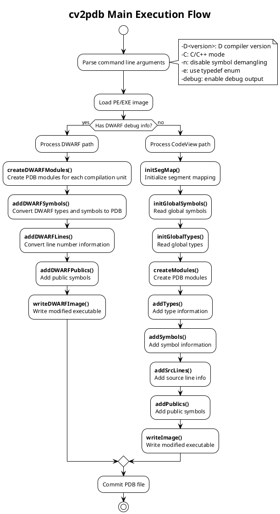
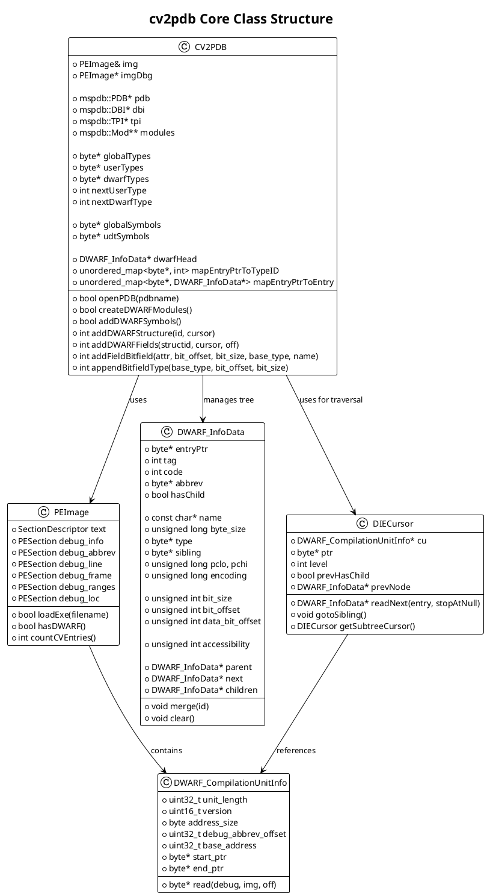
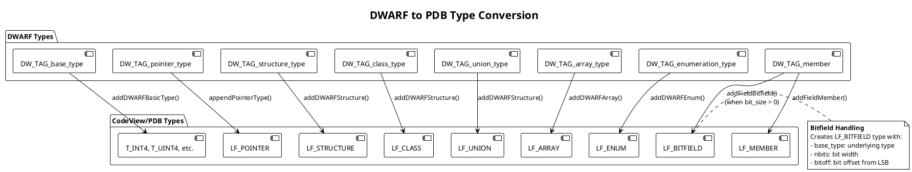
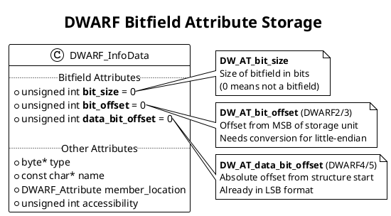
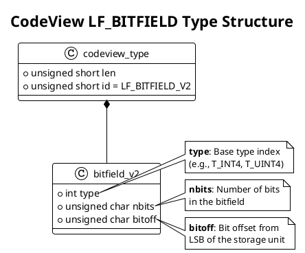
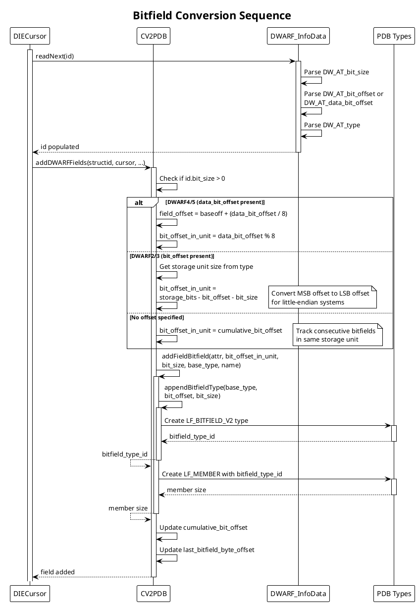
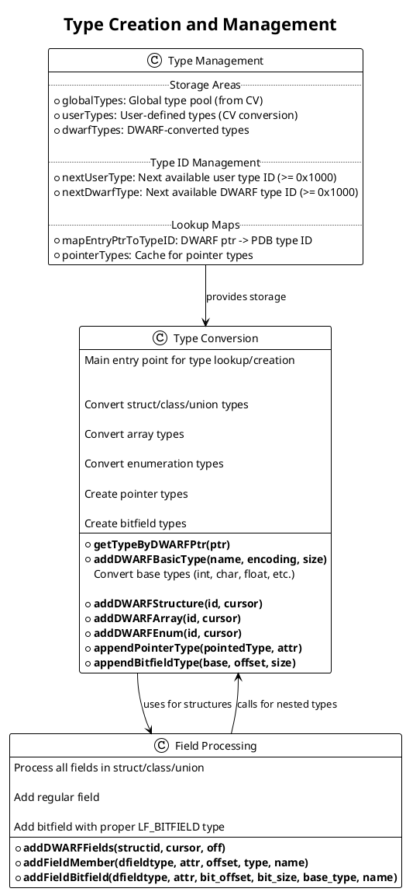
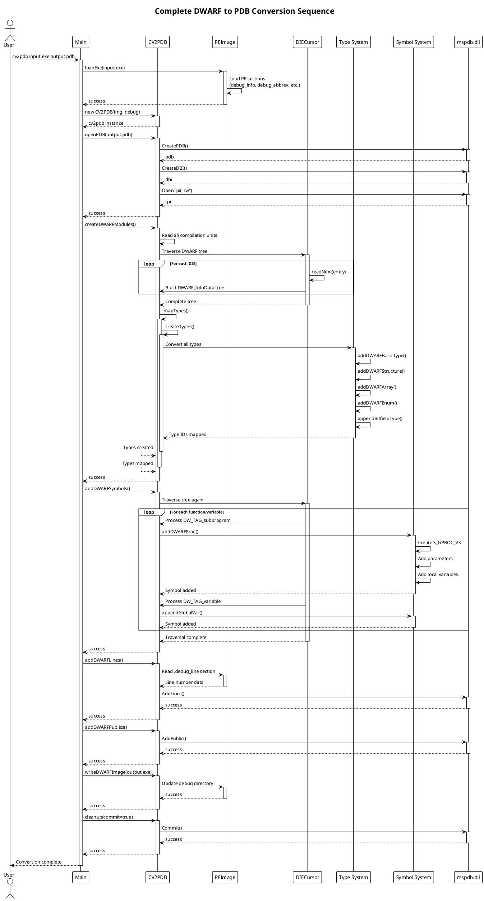

# CV2PDB Architecture and Implementation Guide

## Table of Contents
1. [Overview](#overview)
2. [Main Workflow](#main-workflow)
3. [Core Class Architecture](#core-class-architecture)
4. [Type Conversion System](#type-conversion-system)
5. [Bitfield Implementation](#bitfield-implementation)
6. [Key Functions](#key-functions)
7. [Conversion Sequence](#conversion-sequence)
8. [Example: Bitfield Conversion](#example-bitfield-conversion)

## Overview

**cv2pdb** is a tool that converts DWARF debug information (from GCC/MinGW) and DMD CodeView debug information into Microsoft PDB (Program Database) files for use with Visual Studio debuggers.

### Purpose
- Enable debugging of GCC/MinGW compiled binaries in Visual Studio
- Convert D language debug info to PDB format
- Support C/C++ projects using non-MSVC toolchains

## Main Workflow

The conversion process follows this sequence:



### Main Entry Point
**File:** `src/main.cpp:187-349`

Key steps:
1. **Parse arguments** - Extract options like D version, debug level, output paths
2. **Load executable** - Read PE/EXE file using `PEImage::loadExe()`
3. **Check debug format** - Determine if DWARF or CodeView
4. **Create CV2PDB instance** - Initialize converter with image and debug level
5. **Open PDB** - Create output PDB file via mspdb.dll
6. **Convert debug info** - Call appropriate conversion path
7. **Write output** - Generate modified executable with PDB reference

## Core Class Architecture



### Class Descriptions

#### CV2PDB
**File:** `src/cv2pdb.h:29-308`, `src/cv2pdb.cpp`

The main converter class that orchestrates the entire conversion process.

**Key Responsibilities:**
- Manage PDB file creation and writing via mspdb.dll interfaces
- Maintain type storage buffers (globalTypes, userTypes, dwarfTypes)
- Build and traverse DWARF tree structure
- Convert types from DWARF to CodeView format
- Convert symbols (functions, variables) to PDB format
- Handle line number information

**Type Storage:**
- `globalTypes`: Original CodeView types from input
- `userTypes`: Converted user-defined types
- `dwarfTypes`: Types converted from DWARF (size: ~64KB per type)
- Type IDs start at `BASE_USER_TYPE` (0x1000)

#### PEImage
**File:** `src/PEImage.h`, `src/PEImage.cpp`

Handles loading and parsing of PE/EXE files and their debug sections.

**Debug Sections:**
- `.debug_info`: DWARF DIE (Debug Information Entry) data
- `.debug_abbrev`: Abbreviation tables for DIEs
- `.debug_line`: Source line number information
- `.debug_frame`: Call frame information (stack unwinding)
- `.debug_ranges`: Non-contiguous address ranges
- `.debug_loc`: Location lists (variable locations)

#### DWARF_InfoData
**File:** `src/readDwarf.h:187-340`

In-memory representation of a DWARF Debug Information Entry (DIE).

**Structure:**
- Forms a tree via `parent`, `next`, `children` pointers
- Contains all DWARF attributes (name, type, size, location, etc.)
- Special bitfield attributes: `bit_size`, `bit_offset`, `data_bit_offset`
- `merge()` method combines attributes from specifications/abstract origins

**Tags (examples):**
- `DW_TAG_compile_unit`: Compilation unit root
- `DW_TAG_subprogram`: Function/procedure
- `DW_TAG_structure_type`: Struct/class
- `DW_TAG_member`: Structure member
- `DW_TAG_variable`: Variable declaration

#### DIECursor
**File:** `src/readDwarf.h:572-638`

Iterator for traversing the DWARF tree structure.

**Features:**
- `readNext()`: Read next DIE in depth-first order
- `gotoSibling()`: Skip children and go to next sibling
- `getSubtreeCursor()`: Create cursor for child subtree
- Tracks current level, previous node, sibling pointers
- Handles abbreviation table lookups

## Type Conversion System



### Type Mapping Table

| DWARF Type | CodeView Type | Conversion Function | Notes |
|------------|---------------|---------------------|-------|
| DW_TAG_base_type | T_INT4, T_UINT4, T_REAL32, etc. | `addDWARFBasicType()` | Maps encoding + size to PDB basic types |
| DW_TAG_pointer_type | LF_POINTER | `appendPointerType()` | Creates pointer to target type |
| DW_TAG_structure_type | LF_STRUCTURE | `addDWARFStructure()` | Includes field list |
| DW_TAG_class_type | LF_CLASS | `addDWARFStructure()` | Includes field list, methods |
| DW_TAG_union_type | LF_UNION | `addDWARFStructure()` | All fields at offset 0 |
| DW_TAG_array_type | LF_ARRAY | `addDWARFArray()` | Element type + dimensions |
| DW_TAG_enumeration_type | LF_ENUM | `addDWARFEnum()` | Underlying type + enumerators |
| DW_TAG_member | LF_MEMBER | `addFieldMember()` | Regular field in struct |
| DW_TAG_member (bitfield) | LF_BITFIELD + LF_MEMBER | `addFieldBitfield()` | When bit_size > 0 |

### Type ID Management

**File:** `src/cv2pdb.h:251-254`

```cpp
static constexpr int BASE_USER_TYPE = 0x1000;
int nextUserType = BASE_USER_TYPE;   // For CodeView conversions
int nextDwarfType = BASE_USER_TYPE;  // For DWARF conversions
```

- Type IDs < 0x1000: Predefined types (T_INT4, T_VOID, etc.)
- Type IDs >= 0x1000: User-defined types
- `mapEntryPtrToTypeID`: Maps DWARF DIE pointer to assigned type ID
- Prevents duplicate type creation via lookup

## Bitfield Implementation

Bitfields are structure members that occupy a specific number of bits within a storage unit (typically an integer).

### DWARF Bitfield Attributes



**File:** `src/readDwarf.h:257-259`

Three attributes define a bitfield:

1. **`bit_size`** (DW_AT_bit_size)
   - Number of bits in the bitfield
   - If 0, this is not a bitfield
   - Always present for bitfields

2. **`bit_offset`** (DW_AT_bit_offset) - **DWARF2/3 only**
   - Offset from **MSB** (most significant bit) of storage unit
   - Must be converted to LSB offset for little-endian systems
   - Formula: `lsb_offset = storage_size_bits - bit_offset - bit_size`

3. **`data_bit_offset`** (DW_AT_data_bit_offset) - **DWARF4/5 only**
   - Absolute bit offset from start of containing structure
   - Already in LSB format
   - Byte offset: `data_bit_offset / 8`
   - Bit offset within byte: `data_bit_offset % 8`

### CodeView Bitfield Type



**File:** `src/mscvpdb.h` (CodeView type definitions)

PDB represents bitfields using `LF_BITFIELD` types:

```cpp
struct codeview_bitfield_v2 {
    int type;            // Base type (T_INT4, T_UINT4, etc.)
    unsigned char nbits; // Number of bits
    unsigned char bitoff; // Bit offset from LSB
};
```

Each bitfield member gets:
1. An `LF_BITFIELD` type defining the bit layout
2. An `LF_MEMBER` field referencing that bitfield type

### Bitfield Conversion Algorithm

**File:** `src/dwarf2pdb.cpp:1106-1150`

```cpp
if (id.bit_size > 0) {
    int bit_offset_in_unit = 0;

    // Check if new storage unit or continuation
    if (field_offset != last_bitfield_byte_offset) {
        cumulative_bit_offset = 0;
        last_bitfield_byte_offset = field_offset;
    }

    if (id.data_bit_offset > 0) {
        // DWARF4/5: absolute bit offset
        field_offset = baseoff + (id.data_bit_offset / 8);
        bit_offset_in_unit = id.data_bit_offset % 8;
    }
    else if (id.bit_offset >= 0) {
        // DWARF2/3: MSB offset -> LSB offset
        int storage_size_bits = typeEntry->byte_size * 8;
        bit_offset_in_unit = storage_size_bits - id.bit_offset - id.bit_size;
    }
    else {
        // No offset: sequential bitfields
        bit_offset_in_unit = cumulative_bit_offset;
    }

    // Create bitfield
    addFieldBitfield(dfieldtype, cv_attr, bit_offset_in_unit,
                     id.bit_size, type_to_use, id.name);

    // Track next position
    cumulative_bit_offset = bit_offset_in_unit + id.bit_size;
}
```

**Steps:**
1. **Detect bitfield**: Check if `bit_size > 0`
2. **Determine byte offset**: Calculate which byte contains the bitfield
3. **Calculate bit offset within byte**:
   - **DWARF4/5**: Use `data_bit_offset % 8` (already LSB)
   - **DWARF2/3**: Convert MSB to LSB: `storage_bits - bit_offset - bit_size`
   - **Sequential**: Use cumulative offset for packed bitfields
4. **Create LF_BITFIELD type**: Call `appendBitfieldType()`
5. **Add LF_MEMBER**: Call `addFieldBitfield()`
6. **Update tracking**: Save cumulative offset for next bitfield

### Bitfield Creation Functions

#### appendBitfieldType()
**File:** `src/cv2pdb.cpp:821-843`

Creates an `LF_BITFIELD` type record:

```cpp
int CV2PDB::appendBitfieldType(int base_type, int bit_offset, int bit_size)
{
    checkDWARFTypeAlloc(100);

    codeview_type* bftype = (codeview_type*)(dwarfTypes + cbDwarfTypes);
    bftype->bitfield_v2.id = LF_BITFIELD_V2;
    bftype->bitfield_v2.type = translateType(base_type);
    bftype->bitfield_v2.nbits = bit_size;
    bftype->bitfield_v2.bitoff = bit_offset;

    int len = sizeof(bftype->bitfield_v2);
    bftype->bitfield_v2.len = len - 2;
    cbDwarfTypes += len;

    return nextDwarfType++;  // Return new type ID
}
```

#### addFieldBitfield()
**File:** `src/cv2pdb.cpp:845-865`

Creates an `LF_MEMBER` field that references the bitfield type:

```cpp
int CV2PDB::addFieldBitfield(codeview_fieldtype* dfieldtype, int attr,
                             int bit_offset, int bit_size,
                             int base_type, const char* name)
{
    // Create the LF_BITFIELD type
    int bitfield_type_index = appendBitfieldType(base_type, bit_offset, bit_size);

    // Now create LF_MEMBER with this bitfield type
    // Calculate byte offset (bitfields in same byte share offset)
    int byte_offset = bit_offset / 8;

    return addFieldMember(dfieldtype, attr, byte_offset,
                         bitfield_type_index, name);
}
```

### Bitfield Conversion Sequence



## Key Functions

### Type Creation and Management



### Function Reference

#### getTypeByDWARFPtr()
**File:** `src/dwarf2pdb.cpp`

Main entry point for type conversion. Looks up or creates PDB type for a DWARF type pointer.

```cpp
int CV2PDB::getTypeByDWARFPtr(byte* typePtr)
{
    if (!typePtr) return 0x03; // T_VOID

    // Check cache
    auto it = mapEntryPtrToTypeID.find(typePtr);
    if (it != mapEntryPtrToTypeID.end())
        return it->second;

    // Find DIE and convert based on tag
    DWARF_InfoData* entry = findEntryByPtr(typePtr);
    switch (entry->tag) {
        case DW_TAG_base_type:
            return addDWARFBasicType(entry->name, entry->encoding, entry->byte_size);
        case DW_TAG_structure_type:
        case DW_TAG_class_type:
        case DW_TAG_union_type:
            return addDWARFStructure(*entry, cursor);
        // ... other types
    }
}
```

#### addDWARFStructure()
**File:** `src/dwarf2pdb.cpp:1229+`

Converts DWARF struct/class/union to PDB format.

```cpp
int CV2PDB::addDWARFStructure(DWARF_InfoData& id, DIECursor cursor)
{
    // Create field list
    int flbegin = cbDwarfTypes;
    bool hasBackRef = false;
    int nfields = addDWARFFields(id, cursor, 0, flbegin, hasBackRef);

    // Create LF_FIELDLIST
    // Create LF_STRUCTURE/LF_CLASS/LF_UNION
    // Register in type map
}
```

#### addDWARFFields()
**File:** `src/dwarf2pdb.cpp:1063-1199`

Processes all members of a structure, including bitfields.

```cpp
int CV2PDB::addDWARFFields(DWARF_InfoData& structid, DIECursor& cursor,
                          int baseoff, int flStart, bool& hasBackRef)
{
    int cumulative_bit_offset = 0;
    int last_bitfield_byte_offset = -1;

    DWARF_InfoData id;
    while (cursor.readNext(&id, true)) {
        if (id.tag == DW_TAG_member) {
            if (id.bit_size > 0) {
                // Handle bitfield (see Bitfield Conversion Algorithm)
            } else {
                // Regular field
                addFieldMember(dfieldtype, cv_attr, field_offset,
                              type_to_use, id.name);
            }
        }
    }
}
```

#### addDWARFBasicType()
**File:** `src/dwarf2pdb.cpp`

Maps DWARF basic types to PDB basic types.

```cpp
int CV2PDB::addDWARFBasicType(const char* name, int encoding, int byte_size)
{
    // encoding: DW_ATE_signed, DW_ATE_unsigned, DW_ATE_float, etc.
    // byte_size: 1, 2, 4, 8

    switch (encoding) {
        case DW_ATE_signed:
            switch (byte_size) {
                case 1: return 0x10; // T_CHAR
                case 2: return 0x11; // T_SHORT
                case 4: return 0x74; // T_INT4
                case 8: return 0x76; // T_INT8
            }
        // ... other encodings
    }
}
```

## Conversion Sequence

Complete end-to-end sequence diagram:



### Conversion Phases

1. **Initialization**
   - Load PE/EXE file
   - Create PDB file and interfaces (DBI, TPI)
   - Set up compilation unit modules

2. **Type Mapping** (`createDWARFModules()`)
   - Parse all DWARF DIEs into tree structure
   - Build lookup maps (entryPtr -> DIE, entryPtr -> typeID)
   - Convert all types to PDB format
   - Handle forward references and circular dependencies

3. **Symbol Conversion** (`addDWARFSymbols()`)
   - Traverse tree for functions (DW_TAG_subprogram)
   - Create S_GPROC/S_LPROC symbols
   - Add parameters and local variables
   - Process global variables

4. **Line Numbers** (`addDWARFLines()`)
   - Parse .debug_line section
   - Map source file:line to code address
   - Add to PDB modules

5. **Public Symbols** (`addDWARFPublics()`)
   - Add externally visible symbols
   - Enable symbol lookup by name

6. **Finalization**
   - Update executable debug directory
   - Write RSDS signature with PDB path
   - Commit PDB file

## Example: Bitfield Conversion

### C Source Code

```c
struct MyStruct {
    unsigned int a : 3;   // 3 bits at offset 0
    unsigned int b : 5;   // 5 bits at offset 3
    unsigned int c : 24;  // 24 bits at offset 8
    int d;                // regular field at byte offset 4
};
```

### DWARF Representation

```
DW_TAG_structure_type
  DW_AT_name: "MyStruct"
  DW_AT_byte_size: 8

  DW_TAG_member
    DW_AT_name: "a"
    DW_AT_type: <unsigned int>
    DW_AT_data_bit_offset: 0
    DW_AT_bit_size: 3

  DW_TAG_member
    DW_AT_name: "b"
    DW_AT_type: <unsigned int>
    DW_AT_data_bit_offset: 3
    DW_AT_bit_size: 5

  DW_TAG_member
    DW_AT_name: "c"
    DW_AT_type: <unsigned int>
    DW_AT_data_bit_offset: 8
    DW_AT_bit_size: 24

  DW_TAG_member
    DW_AT_name: "d"
    DW_AT_type: <int>
    DW_AT_data_member_location: 4
```

### PDB Representation

```
LF_STRUCTURE "MyStruct"
  size: 8
  field_list: <fieldlist_1>

<fieldlist_1> LF_FIELDLIST

  LF_MEMBER "a"
    type: <bitfield_type_1>
    offset: 0

  LF_MEMBER "b"
    type: <bitfield_type_2>
    offset: 0

  LF_MEMBER "c"
    type: <bitfield_type_3>
    offset: 1

  LF_MEMBER "d"
    type: T_INT4
    offset: 4

<bitfield_type_1> LF_BITFIELD
  base_type: T_UINT4
  nbits: 3
  bitoff: 0

<bitfield_type_2> LF_BITFIELD
  base_type: T_UINT4
  nbits: 5
  bitoff: 3

<bitfield_type_3> LF_BITFIELD
  base_type: T_UINT4
  nbits: 24
  bitoff: 0
```

### Conversion Steps

1. **Structure "a"** (data_bit_offset=0, bit_size=3)
   - Byte offset: `0 / 8 = 0`
   - Bit offset: `0 % 8 = 0`
   - Create `LF_BITFIELD(T_UINT4, nbits=3, bitoff=0)` → type ID 0x1001
   - Create `LF_MEMBER("a", type=0x1001, offset=0)`

2. **Structure "b"** (data_bit_offset=3, bit_size=5)
   - Byte offset: `3 / 8 = 0` (same byte as 'a')
   - Bit offset: `3 % 8 = 3`
   - Create `LF_BITFIELD(T_UINT4, nbits=5, bitoff=3)` → type ID 0x1002
   - Create `LF_MEMBER("b", type=0x1002, offset=0)`

3. **Structure "c"** (data_bit_offset=8, bit_size=24)
   - Byte offset: `8 / 8 = 1` (new byte)
   - Bit offset: `8 % 8 = 0` (starts at LSB of byte 1)
   - Create `LF_BITFIELD(T_UINT4, nbits=24, bitoff=0)` → type ID 0x1003
   - Create `LF_MEMBER("c", type=0x1003, offset=1)`

4. **Regular field "d"** (offset=4, type=int)
   - Create `LF_MEMBER("d", type=T_INT4, offset=4)`

### Memory Layout

```
Byte 0:  [bbbbbaaa]  (a: bits 0-2, b: bits 3-7)
Byte 1:  [cccccccc]  (c: bits 0-7)
Byte 2:  [cccccccc]  (c: bits 8-15)
Byte 3:  [cccccccc]  (c: bits 16-23)
Byte 4-7: [dddddddd]  (d: int, 4 bytes)
```

## Implementation Files

| File | Lines | Description |
|------|-------|-------------|
| `src/main.cpp` | 350 | Entry point, command-line parsing, orchestration |
| `src/cv2pdb.h` | 311 | CV2PDB class declaration |
| `src/cv2pdb.cpp` | ~3000 | CV2PDB implementation, type conversion, field handling |
| `src/dwarf2pdb.cpp` | ~2500 | DWARF-specific conversion (structures, symbols, functions) |
| `src/readDwarf.h` | 645 | DWARF data structures (InfoData, DIECursor, Location) |
| `src/readDwarf.cpp` | ~2000 | DWARF parsing, DIE reading, location expressions |
| `src/PEImage.h/cpp` | ~1500 | PE file loading, section management |
| `src/mscvpdb.h` | ~1000 | CodeView/PDB type definitions |
| `src/dwarf.h` | ~500 | DWARF constants (tags, attributes, encodings) |

### Key Code Locations

| Function | File:Line | Purpose |
|----------|-----------|---------|
| `main()` | `src/main.cpp:187` | Program entry point |
| `CV2PDB::openPDB()` | `src/cv2pdb.cpp:135` | Create PDB file |
| `CV2PDB::createDWARFModules()` | `src/dwarf2pdb.cpp` | Initialize DWARF processing |
| `CV2PDB::addDWARFStructure()` | `src/dwarf2pdb.cpp:1229+` | Convert struct/class/union |
| `CV2PDB::addDWARFFields()` | `src/dwarf2pdb.cpp:1063` | Process structure members |
| `CV2PDB::appendBitfieldType()` | `src/cv2pdb.cpp:821` | Create LF_BITFIELD type |
| `CV2PDB::addFieldBitfield()` | `src/cv2pdb.cpp:845` | Add bitfield member |
| `CV2PDB::addDWARFProc()` | `src/dwarf2pdb.cpp:854` | Convert function symbols |
| `DIECursor::readNext()` | `src/readDwarf.cpp` | Read next DWARF DIE |
| `decodeLocation()` | `src/readDwarf.cpp:112` | Evaluate location expressions |

## Bitfield Testing

To test bitfield support:

1. **Compile with debug info:**
   ```bash
   gcc -g -gdwarf-4 test_bitfield.c -o test_bitfield.exe
   ```

2. **Convert to PDB:**
   ```bash
   cv2pdb test_bitfield.exe
   ```

3. **Verify in Visual Studio:**
   - Open test_bitfield.exe in VS debugger
   - Set breakpoint in function using struct with bitfields
   - Inspect structure in Watch window
   - Verify bitfield values are correctly displayed
   - Try modifying bitfield values

4. **Check with cvdump:**
   ```bash
   cvdump -t test_bitfield.pdb | grep -A 10 "LF_BITFIELD"
   ```

## References

- **DWARF Specification**: http://dwarfstd.org/
- **Microsoft PDB Format**: https://github.com/microsoft/microsoft-pdb
- **CodeView Type Records**: Part of Microsoft Debug Interface Access SDK
- **cv2pdb Repository**: https://github.com/rainers/cv2pdb

## Notes on Recent Bitfield Changes

The bitfield implementation was recently updated in `src/dwarf2pdb.cpp` and `src/readDwarf.cpp` to properly handle:

1. **DWARF4/5 data_bit_offset attribute** - Absolute bit offset from structure start
2. **DWARF2/3 bit_offset attribute** - MSB offset requiring conversion to LSB
3. **Consecutive bitfields** - Tracking cumulative bit position within storage units
4. **Accessibility attributes** - Converting DWARF access specifiers to CodeView format
5. **Storage unit detection** - Properly grouping bitfields sharing the same byte offset

These changes ensure correct bitfield debugging in Visual Studio for code compiled with GCC/MinGW across different DWARF versions.
